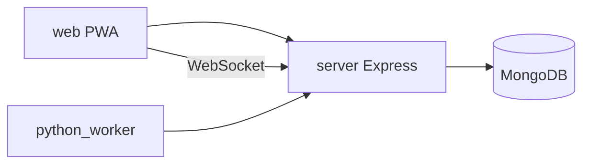

# WIA Technical Specification

## System architecture

WIA is a client-server campus operating system:

| Layer | Technology | Responsibility |
| --- | --- | --- |
| Web | React 18, Vite, TypeScript, Zustand | Map UI, admin workspace, PWA |
| API | Express (ESM), Mongoose | REST `/api/v1`, JWT admin auth, datasets |
| Data | MongoDB | Geo datasets, power reports, telemetry, notifications |
| Realtime | `ws` on `/ws/power`, `/ws/live-location` | Live status streams |
| Worker (optional) | Python 3.9+ stdlib | Route telemetry analytics |



Deep frontend notes: [web/ARCHITECTURE.md](../web/ARCHITECTURE.md).

## Configuration

* **Runtime campus identity:** `web/src/config/client.ts` (`campus_id`, map center, feature flags).
* **Planning template:** `kit/config.template.json` (not loaded by the app).
* **API URL:** `VITE_API_BASE_URL` in `web/.env.local` (use `/api/v1` with Vite proxy in development).

## Map datasets

Two dataset types are stored in MongoDB and seeded from `server/public/data/` on first boot:

| Type | Seed file | Content |
| --- | --- | --- |
| `locations` | `sample.geojson` | Buildings, POIs (polygons and non-routing points) |
| `routing` | `campus-routing.geojson` | Bootstrap stub only until first import |

**Single-file import:** Admins upload one mixed Overpass-style `FeatureCollection` (e.g. `sample.geojson`). The admin upload engine auto-splits by geometry — polygons to locations, LineStrings and routing Points to routing. See [tutorials/MAPPING_GUIDE.md](../tutorials/MAPPING_GUIDE.md).

Admin APIs under `/api/v1/admin/map/*` support feature CRUD, bulk upsert, bundle import, and revision history.

## Authentication

* Public map and power endpoints are unauthenticated (rate-limited).
* Admin routes use JWT (HTTP-only cookie + bearer-compatible flows).
* First admin: `POST /api/v1/admin/register` with JSON `{ "email", "password" }`.
* Analytics worker: `ANALYTICS_WORKER_TOKEN` header on `/api/v1/analytics/worker/*`.

## GeoJSON compliance (RFC 7946)

* **Coordinate ordering:** `[longitude, latitude]` (X, Y).
* **Polygon closure:** `coordinate[0] === coordinate[coordinate.length - 1]` for each ring.

### Core location feature schema

```json
{
  "type": "Feature",
  "properties": {
    "id": "string",
    "name": "string",
    "type": "string",
    "category": "string",
    "utilities": {
      "hasPower": true,
      "chargingNodesAvailable": 0,
      "accessibilityRamps": true
    }
  },
  "geometry": {
    "type": "Polygon",
    "coordinates": [[[0.0, 0.0]]]
  }
}
```

### Routing graph

* **Nodes:** `Point` geometries with `properties.node_id`.
* **Edges:** `LineString` with `from` / `to` node ids, or tagged for inference (`highway`, `kind=edge`).

Validation is enforced in `server/src/services/routingGraphValidator.js`.

## Related docs

* [SETUP_GUIDE.md](./SETUP_GUIDE.md)
* [ROUTE_ANALYTICS_WORKER.md](./ROUTE_ANALYTICS_WORKER.md)
* [server/README.md](../server/README.md)
